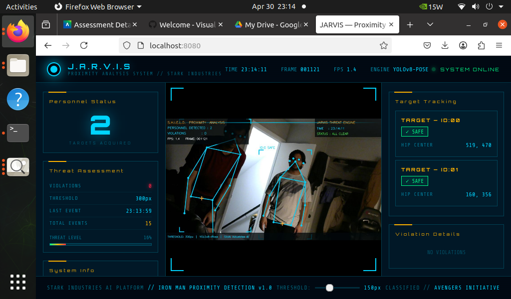
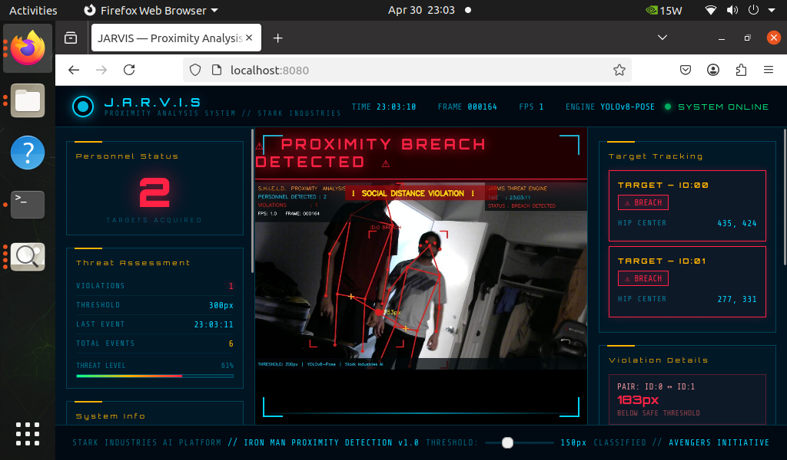

# 🦾 JARVIS Social Proximity Analysis System
### *Iron Man Themed Social Distancing Detection — Jetson Nano*

> *"JARVIS, run a proximity scan on the personnel."*


---

## 📌 Overview

Real-time **Social Distancing Detection** running on **NVIDIA Jetson Nano** using **YOLOv8n-Pose**. The system monitors a live camera feed, detects all persons using pose estimation, extracts hip keypoints to estimate each person's position, computes Euclidean distances between all detected pairs, and flags violations with a full **Iron Man / JARVIS HUD** displayed in the browser.

---

## 🎯 Assignment Objectives Met

- ✅ Run human pose estimation using YOLOv8n-Pose (poseNet-equivalent)
- ✅ Extract and interpret keypoints (left_hip / right_hip midpoint) per person
- ✅ Compute Euclidean pixel distances between all detected pairs
- ✅ Flag and visualize violations in real-time with Iron Man JARVIS HUD
- ✅ Browser-based UI with live MJPEG stream and REST API status

---

## 📸 Results

### ✅ Normal — No Violation Detected
*Two persons detected, distance above threshold — cyan skeletons, ALL CLEAR status*



---

### ⚠️ Anomaly Detected — Proximity Breach
*Two persons too close — red skeletons, PROXIMITY BREACH DETECTED banner, violation details shown*



---

## 🏗️ System Architecture

```
Camera (USB Webcam)
        │
        ▼
YOLOv8n-Pose (CPU/GPU)
        │
        ▼
Extract 17 COCO Keypoints per Person
        │
        ▼
Compute Hip Center = (left_hip + right_hip) / 2
        │
        ▼
Euclidean Distance between all person pairs
        │
        ├── distance < threshold ──► 🔴 VIOLATION
        │                              Red skeleton + Alert
        └── distance ≥ threshold ──► 🔵 SAFE
                                       Cyan skeleton
        │
        ▼
Flask Server (port 8080)
  ├── /stream  ── MJPEG video feed
  ├── /status  ── JSON live data
  └── /        ── JARVIS HTML UI
```

---

## 📁 Project Structure

```
JARVIS-SOCIAL-DISTANCING/
│
├── jarvis_detector.py    ← Main backend (YOLOv8 + Flask)
├── ironman_ui.html       ← Iron Man JARVIS browser dashboard
├── README.md             ← This file
└── results/
    ├── image01.png       ← Screenshot: No violation detected
    └── image02.png       ← Screenshot: Anomaly detected
```

---

## 🧠 How It Works

### 1. Pose Estimation
YOLOv8n-Pose runs on every camera frame and returns 17 COCO keypoints `(x, y, confidence)` for each detected person.

### 2. Person Center Estimation
The **midpoint of left and right hip keypoints** approximates each person's location:
```python
hip_center_x = (left_hip.x + right_hip.x) / 2
hip_center_y = (left_hip.y + right_hip.y) / 2
```

### 3. Distance Computation
Euclidean distance between every pair of persons:
```python
distance = sqrt((cx_i - cx_j)² + (cy_i - cy_j)²)

if distance < DISTANCE_THRESHOLD:
    → FLAG VIOLATION
```

### 4. Visualization
| State | Skeleton | Bounding Box | Banner |
|---|---|---|---|
| ✅ Safe | Cyan | Cyan bracket | ALL CLEAR |
| ⚠️ Violation | Red | Red bracket | PROXIMITY BREACH |

---

## 🛠️ Setup

### Prerequisites
```bash
pip3 install ultralytics flask opencv-python numpy
```

### Run
```bash
# Start the detector
python3 jarvis_detector.py --camera 0

# Open browser
http://localhost:8080
```

### Arguments

| Argument | Default | Description |
|---|---|---|
| `--camera` | `0` | Camera index |
| `--distance` | `200` | Violation pixel threshold |
| `--port` | `8080` | Flask server port |
| `--width` | `960` | Capture width |
| `--height` | `540` | Capture height |

---

## 🎨 JARVIS HUD Features

| Feature | Description |
|---|---|
| **Arc Reactor logo** | Animated pulsing cyan ring |
| **Live camera feed** | MJPEG stream with scanning line effect |
| **Personnel Status** | Real-time person count |
| **TARGET cards** | Per-person ID with SAFE / BREACH status |
| **Violation Details** | Pair IDs + pixel distance |
| **Keypoint confidence** | Per-joint confidence bars |
| **Threat Level bar** | Visual threat meter |
| **Flashing alert** | PROXIMITY BREACH DETECTED banner |
| **Event log** | Timestamped violation history |
| **Threshold slider** | Adjust detection sensitivity live |
| **CSV logging** | All violations saved to results/ |

---

## 🧠 Social Distancing Logic

```python
# Hip midpoint per person
hip_center = (left_hip + right_hip) / 2

# Euclidean distance between two persons
distance = sqrt((x1-x2)² + (y1-y2)²)

# Violation check
if distance < DISTANCE_THRESHOLD:
    → FLAG VIOLATION — red skeleton + alert
```

---

## ⚙️ Tuning the Threshold

| Camera Distance | Recommended Threshold |
|---|---|
| ~1 m | 300–400 px |
| ~2–3 m | 200–250 px |
| ~4–6 m | 100–150 px |

---

## 📚 Concepts Covered

- Human pose estimation with **YOLOv8n-Pose** (17 COCO keypoints)
- **Hip midpoint** computation for person localization
- **Euclidean distance** in image pixel coordinates
- Real-time video processing with **OpenCV**
- Rule-based anomaly detection with threshold comparison
- **Flask MJPEG streaming** for browser-based display
- **REST API** for live telemetry data

---

## 👤 Author

**Tilakraj**
Jetson AI — Social Distancing Lab
*Stark Industries Certified ™*

---

> *"Sometimes you gotta run before you can walk."* — Tony Stark
